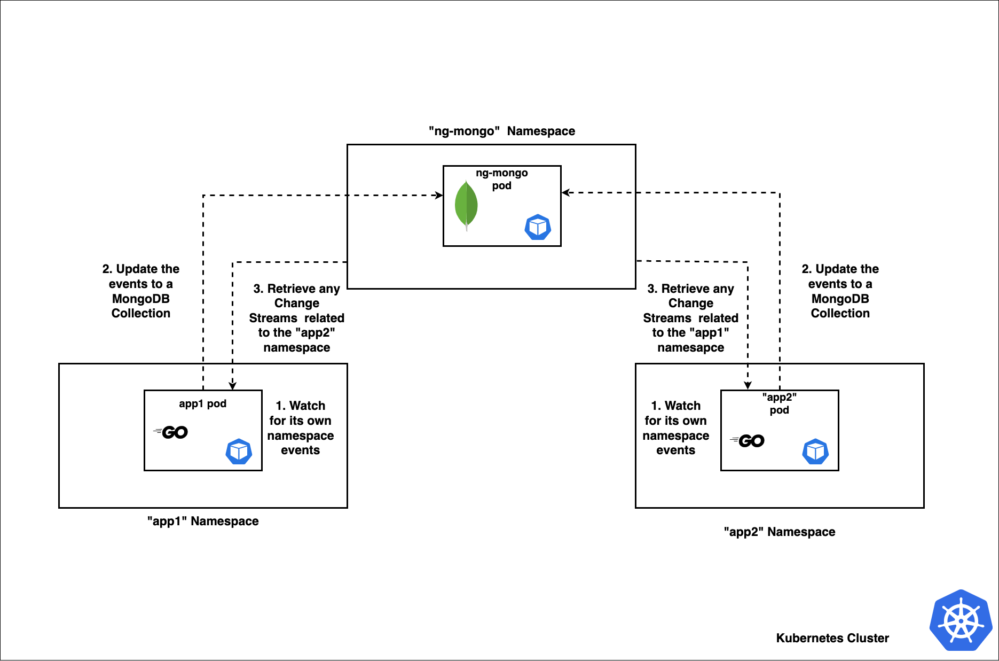

# client-go-watcher
This repo contains the code snippet that watch for various Kubernetes resource events in a namespace 


# Prerequisites

Before running this application, please make sure following tools are installed properly.

- `minikube` - version: v1.26.0
- `helm` - version: v3.9.0

# Architecture Diagram



## 1. Deploy the `mongodb `

We are using a simple `mongodb` StatefulSet so our applications can communicate with each other with the [ChangeStreams](https://www.mongodb.com/docs/manual/changeStreams/)

> Note: And we haven't set any volumes for persistent of data as well as no passwords just to ease the things out. But it is recommended to use the best practices like this for an actual scenario. 

```
helm install ng-mongo helm/mongo --namespace ng-mongo --create-namespace
```


Then check the pod status / logs
```
kubectl get pods -n ng-mongo

kubectl logs -f mongo-0 -c mongo -n ng-mongo
```

Then initialize the replica set
```
kubectl exec -it mongo-0 -n ng-mongo mongosh

rs.initiate({_id: "rs0",members: [{_id: 0, host: "mongo-0.mongo.ng-mongo.svc.cluster.local:27017"}]})
```


## 2. Deploy the `app1` and `app2`

Since the both `app1` and `app2` which are running on both the namespaces are identical, except for the namespaces they watch and receive events from, we are using the same helm chart inside the `helm/app` directory. 

When running the helm charts, please set the following 2 variables, so each application will be deployed independently in different namespace

| variable | Description |
| --- | --- |
| common_name | This will be the `namespace` where a particular application will be deployed and watching for the events |
| other_namespace_to_watch | This variable used to set the other namespace, where the each application will recieve the events from |


for `app1`

```
helm install app1 helm/app --set common_name=app1 \
--set other_namespace_to_watch=app2 --namespace app1 --create-namespace
```

Then check the logs app1 logs 
```
kubectl logs -f <POD-NAME> -n app1
```


for `app2`
```
helm install app2 helm/app --set common_name=app2 \
--set other_namespace_to_watch=app1 --namespace app2 --create-namespace
```

Then check the logs app1 logs 
```
kubectl logs -f <POD-NAME> -n app2
```

# How to Test the Application Funcationality?

1. Fire up your favourite terminal and Log the application logs of the both pods in both namesaces

```
kubectl logs -f <app1-POD-NAME> -n app1

kubectl logs -f <app2-POD-NAME> -n app2
```

2. Create a new deployment in either `app1` namespace or `app2` namespace

```
kubectl create deployment redis --image=redis --replicas=1 -n app1
```

And monitor for the log outputs in both apps 

3. Edit the deployment and add a new container

```
kubectl edit deploy -redis -n app1

...
      containers:
      - image: redis
        name: redis

     # newly added container
      - image: nginx:alpine 
        imagePullPolicy: Always
        name: nginx
...
```

Save it and for the log outputs in both apps.

This will also triger the delete action and you can see it too. Or you can even try deleting the redis pods and see.


4. Change the existing Image of the redis deployment

```
kubectl edit deploy -redis -n app1

...
      containers:
        # change image from 'redis:latest' to 'redis:alpine '
      - image: redis:alpine 
        name: redis

      - image: nginx:alpine 
        imagePullPolicy: Always
        name: nginx
...
```


Save it and for the log outputs in both apps.

Each of these actions are saved in the MongoDB separate columns and with the right mongodb commands, you can retrive the followings;

- a) All pod names of pods running in both the namespaces
- b) Number of containers running in each pod
- c) Images of each running container in each pod


# Test Suite

To run the test cases;

```
go test -v
```

> Note: When running tests, you need to have a local mongo cluster running, please specify it below, or proxy the running statefulset as below and update the connection URI accordingly
(eg: `var mongo_uri = "mongodb://localhost:27017"`)

```
kubectl port-forward mongo-0 27017:27017 -n ng-mongo
```